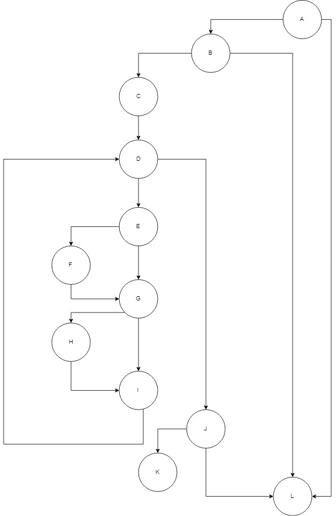

# SI_lab2_183003
## Владимир Здравковски, број на индекс 183003

**Група на код:**

Ја добив групата на код 1

* Control Flow Graph




* Цикломатска комплексност

Цикломатската комплексност на функцијата е 6.

Истата e добиена со на формулата (број на ребра - број на јазли) + 2, во случајов бројот на ребра е 16, а на јазли е 12,па оттука (16-12+2)=6. Исто така со број на региони цикломатската комплексност излегува 6.

* Тест случаи според критериумот **Every Branch**

Табелата за овој критериум може да ја најдете во репото под име Every Branch.xlsx. 
Има вкупно 5 тест случаи според овој критериум.


* Тест случаи според критериумот **Every Path**

Табелата за овој критериум може да ја најдете во репото под име Every Path.xlsx. 
Има вкупно 5 тест случаи според овој критериум.


* Објаснување на напишаните unit tests

**Every Branch tests**

Inputs -> (Корисничко име, Лозинка, Е-маил)\
User1 (Vladimir, 1234, vzdr@gmail.com)\
User2 (null)\
User3 (Vladimir, 1234, vzdr2gmail.com)\
User4 (Vladimir, 1234, vzdr@gmail!com)\
User5 (Vladimir, 1234, vzdr2gmail!com)\

```
Кај првиот тест случај (User1)  вредноста на сите променливи е валидна и се опфатени сите јазли освен А и L.

Кај вториот тест случај (User2) вредноста на user е null, па затоа се опфатени само јазолите А и L

Кај треттиот тест случај (User3) вредноста на променливата емаил не содржи @ и тука се опфатени сите јазли освен F и K.

Кај четврттиот тест случај (User4) вредноста на променливата емаил не содржи . и тука се опфатени сите јазли освен Н и K.

Кај петтиот тест случај (User5) вредноста на променливата емаил не содржи @ и., и тука се опфатени сите јазли освен F, Н и K.


```

**Every Path tests**

Inputs -> (Корисничко име, Лозинка, Е-маил)\
User1 (Vladimir, 1234, vzdr@gmail.com)\
User2 (null)\
User3 (Vladimir, 1234, vzdr2gmail.com)\
User4 (Vladimir, 1234, vzdr@gmail!com)\
User5 (Vladimir, 1234, vzdr2gmail!com)\

```
Кај првиот тест случај (User1)  вредноста на сите променливи е валидна и се опфатени сите јазли освен А и L.

Кај вториот тест случај (User2) вредноста на user е null, па затоа се опфатени само јазолите А и L

Кај треттиот тест случај (User3) вредноста на променливата емаил не содржи @ и тука се опфатени сите јазли освен F и K.

Кај четврттиот тест случај (User4) вредноста на променливата емаил не содржи . и тука се опфатени сите јазли освен Н и K.

Кај петтиот тест случај (User5) вредноста на променливата емаил не содржи @ и., и тука се опфатени сите јазли освен F, Н и K.


```
